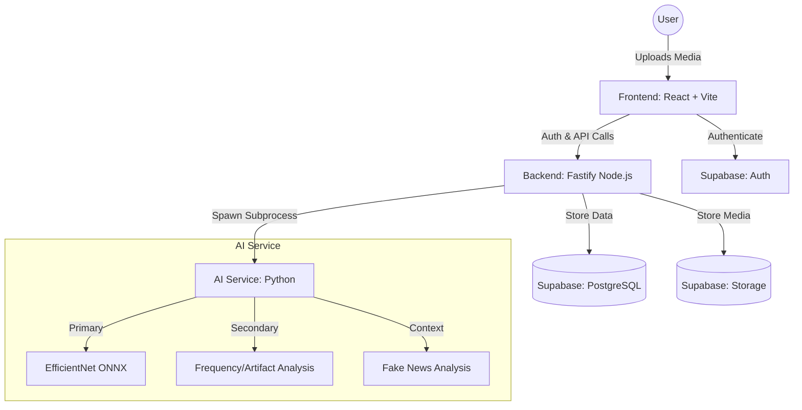

# 🎯 TrueFrame — AI-Powered Deepfake Detection Platform

TrueFrame is an authenticity-first social media platform where every piece of content is verified by AI before it reaches the feed. Deepfakes, manipulated images, and fake news are blocked at the gate, ensuring that "Only truth gets published."

---

## 🏗️ System Architecture (Block Diagram)

### Component Description:
- **Frontend**: A high-performance React SPA built with Vite and TypeScript. It handles media previews, real-time verification progress, and the trust-ranked feed.
- **Backend**: A Fastify server that serves as the orchestration layer. It manages the **fail-closed** verification pipeline and communicates with Supabase.
- **AI Service**: A modular Python engine performing multi-stage detection using ONNX Runtime, OpenCV, and specialized ML models.
- **Supabase**: Provides a unified backend for authentication, PostgreSQL storage for metadata, and S3-compatible storage for verified media.

---

## 🧪 Methodology

### Dataset
The detection models are trained and validated using a combination of public deepfake datasets, primarily the **`dima806/deepfake_vs_real_image_detection`** ensemble from HuggingFace, supplemented by internal GAN-generated artifacts for frequency-domain training.

### Model Architecture
TrueFrame employs a **Weighted Score Fusion** architecture:
- **Primary Stage**: Uses **EfficientNet-B0** (optimized via ONNX) for fast spatial feature extraction.
- **Secondary Stage**: Uses **Frequency Spectrum Analysis** (Azimuthal FFT) to detect unnatural power spectral density distributions typical of GANs.
- **Spatial Heuristics**: Multi-patch consistency voting and SRM-style noise residual analysis to catch local manipulations.

### Training & Validation
The system is designed with a **fail-closed** methodology. Any ambiguity in the AI output, timeout, or processing error results in an automatic "Rejected" status to prioritize platform integrity over content volume.

---

## 📊 Algorithm Table (Primary Detection)

| Component | Model/Technique | Weight | Purpose |
| :--- | :--- | :--- | :--- |
| **Neural Network** | EfficientNet-B0 + Ensemble | 40% | Core spatial deepfake feature detection |
| **Artifact Analysis** | GAN Fingerprint Heuristics | 20% | Detecting GAN-specific pixel-level artifacts |
| **Temporal Analysis** | Optical Flow Consistency | 15% | Ensuring face consistency across video frames |
| **Compression** | JPEG Ghost Detection | 15% | Identifying re-compression and splicing |
| **Metadata Scan** | EXIF Integrity Check | 10% | Verifying capture device and edit history |

---

## 🔄 Verification Flowchart

### 10-Step Pipeline Steps:
1.  **Authentication**: Verify user identity via Supabase JWT.
2.  **Deduplication**: SHA256 hashing to block previously rejected content.
3.  **Metadata Analysis**: Scan EXIF headers for suspicious editing software signatures.
4.  **Frame Extraction**: Extract keyframes (for video) or preprocess image.
5.  **Face Detection**: Locate and align faces using **MTCNN**.
6.  **AI Inference**: Run the EfficientNet-B0 ONNX model ensemble.
7.  **Frequency Analysis**: Perform FFT to check for high-frequency GAN noise.
8.  **Artifact Scan**: Check for "checkerboard" effects and blending inconsistencies.
9.  **Score Fusion**: Calculate the final weighted authenticity score.
10. **Verdict**: 
    - **Score < 0.60**: `APPROVED` → Publish to Feed.
    - **Score 0.60–0.79**: `UNDER_REVIEW` → Hold for manual check.
    - **Score ≥ 0.80**: `REJECTED` → Block and penalize Trust Score.

---

## 🛠️ Technologies Used

### Frontend
- React 18 + Vite
- TypeScript
- Tailwind CSS (Dark-mode first)
- shadcn-ui + Framer Motion
- TanStack Query

### Backend
- Fastify (Node.js)
- Supabase (PostgreSQL, Auth, Storage)
- Zod (Schema Validation)

### AI Service
- Python 3.9+
- ONNX Runtime
- OpenCV & MTCNN
- NumPy & PyExifTool

---

## 📦 Getting Started

Refer to [HOW_TO_RUN.md](./HOW_TO_RUN.md) for detailed installation and environment setup instructions.

---

## 📄 License
This project is licensed under the MIT License.
