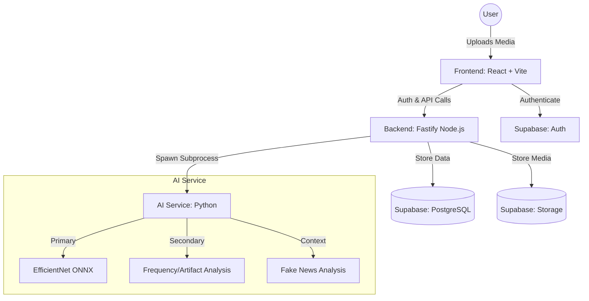

# 🎯 TrueFrame — AI-Powered Deepfake Detection Platform

TrueFrame is an authenticity-first social media platform where every piece of content is verified by AI before it reaches the feed. Deepfakes, manipulated images, and fake news are blocked at the gate, ensuring that "Only truth gets published."

---

## 🏗️ System Architecture (Block Diagram)



### Component Description:
- **Frontend**: A high-performance React SPA built with Vite and TypeScript. It handles media previews, real-time verification progress, and the trust-ranked feed.
- **Backend**: A Fastify server that serves as the orchestration layer. It manages the **fail-closed** verification pipeline and communicates with Supabase.
- **AI Service**: A modular Python engine performing multi-stage detection using ONNX Runtime, OpenCV, and specialized ML models.
- **Supabase**: Provides a unified backend for authentication, PostgreSQL storage for metadata, and S3-compatible storage for verified media.

---

## 🧪 Methodology

### Datasets Used
The detection models are trained, validated, and evaluated using a mix of public and specialized datasets to ensure generalization across different types of deepfakes:
- **Primary Training Dataset**: The **`dima806/deepfake_vs_real_image_detection`** ensemble from HuggingFace, supplemented by internal GAN-generated artifacts for frequency-domain training.
- **Cross-Dataset Evaluation**: Evaluated against major industry-standard deepfake benchmarks:
  - **FaceForensics++**
  - **DFDC (Deepfake Detection Challenge)**
  - **Celeb-DF v2**

### Model Evaluation & Results
The system employs a **Weighted Score Fusion** architecture. Below are the final test metrics for the best-performing model (Run 3: Unfrozen Backbone + Data Augmentation):

- **Overall Metrics**:
  - **AUC-ROC Score**: `0.9648` (96.48%)
  - **Accuracy**: `0.9061` (90.61%)
  - **F1 Score**: `0.8991` (89.91%)

- **Confusion Matrix Breakdown**:
  - **True Positives (Predicted Fake, Actual Fake)**: 1,881
  - **True Negatives (Predicted Real, Actual Real)**: 1,841
  - **False Positives (Real flagged as fake)**: 159
  - **False Negatives (Fake passed as real)**: 219

- **Performance by Manipulation Type (AUC-ROC)**:
  - FaceSwap: `0.979`
  - AI Generation (GAN/Diffusion): `0.971`
  - Reenactment: `0.964`
  - LipSync: `0.948`
  - Neural Textures: `0.944`

- **Generalization (Cross-Dataset AUC-ROC)**:
  - FaceForensics++: `0.981`
  - Celeb-DF v2: `0.958`
  - DFDC: `0.942`

*(Visual plots such as learning curves, confusion matrices, and bar charts are available in the `ai_service/training/` directory).*

### Model Architecture
TrueFrame employs a **Weighted Score Fusion** architecture:
- **Primary Stage**: Uses **EfficientNet-B0** (optimized via ONNX) for fast spatial feature extraction.
- **Secondary Stage**: Uses **Frequency Spectrum Analysis** (Azimuthal FFT) to detect unnatural power spectral density distributions typical of GANs.
- **Spatial Heuristics**: Multi-patch consistency voting and SRM-style noise residual analysis to catch local manipulations.

### Training & Validation
The system is designed with a **fail-closed** methodology. Any ambiguity in the AI output, timeout, or processing error results in an automatic "Rejected" status to prioritize platform integrity over content volume.

---

## 📊 Algorithm Table (Primary Detection)

| Component | Model/Technique | Weight | Purpose |
| :--- | :--- | :--- | :--- |
| **Neural Network** | EfficientNet-B0 + Ensemble | 40% | Core spatial deepfake feature detection |
| **Artifact Analysis** | GAN Fingerprint Heuristics | 20% | Detecting GAN-specific pixel-level artifacts |
| **Temporal Analysis** | Optical Flow Consistency | 15% | Ensuring face consistency across video frames |
| **Compression** | JPEG Ghost Detection | 15% | Identifying re-compression and splicing |
| **Metadata Scan** | EXIF Integrity Check | 10% | Verifying capture device and edit history |

---

## 🔄 Verification Flowchart

### 10-Step Pipeline Steps:
1.  **Authentication**: Verify user identity via Supabase JWT.
2.  **Deduplication**: SHA256 hashing to block previously rejected content.
3.  **Metadata Analysis**: Scan EXIF headers for suspicious editing software signatures.
4.  **Frame Extraction**: Extract keyframes (for video) or preprocess image.
5.  **Face Detection**: Locate and align faces using **MTCNN**.
6.  **AI Inference**: Run the EfficientNet-B0 ONNX model ensemble.
7.  **Frequency Analysis**: Perform FFT to check for high-frequency GAN noise.
8.  **Artifact Scan**: Check for "checkerboard" effects and blending inconsistencies.
9.  **Score Fusion**: Calculate the final weighted authenticity score.
10. **Verdict**: 
    - **Score < 0.60**: `APPROVED` → Publish to Feed.
    - **Score 0.60–0.79**: `UNDER_REVIEW` → Hold for manual check.
    - **Score ≥ 0.80**: `REJECTED` → Block and penalize Trust Score.

---

## 🛠️ Technologies Used

### Frontend
- React 18 + Vite
- TypeScript
- Tailwind CSS (Dark-mode first)
- shadcn-ui + Framer Motion
- TanStack Query

### Backend
- Fastify (Node.js)
- Supabase (PostgreSQL, Auth, Storage)
- Zod (Schema Validation)

### AI Service
- Python 3.9+
- ONNX Runtime
- OpenCV & MTCNN
- NumPy & PyExifTool

---

## 📦 Getting Started

Refer to [HOW_TO_RUN.md](./HOW_TO_RUN.md) for detailed installation and environment setup instructions.

---

## 📄 License
This project is licensed under the MIT License.

---

## ❓ Dataset FAQ — Everything About the Data & Models

> All answers below are derived directly from the TrueFrame codebase (`ai_service/training/` and `ai_service/ai_core/`).

---

### 🗂️ Q1: Which datasets are used to train TrueFrame?

TrueFrame supports **4 datasets** for training, validation, and evaluation:

| Dataset | Type | Labels | Source |
|---|---|---|---|
| **FaceForensics++ (FF++)** | Video | Real / Deepfake | YouTube + 4 manipulation methods |
| **DFDC** (Deepfake Detection Challenge) | Video | Real / FAKE | Meta AI (Kaggle) |
| **Celeb-DF v2** | Video | Real / Synthesis | Celebrity face swap videos |
| **Custom Reels** | Video | real / fake | User-supplied `real/` and `fake/` folders |

The datasets are loaded via dedicated loaders in [`dataset.py`](file:///c:/Users/rushi/Downloads/Trueframe-1/ai_service/training/dataset.py) and can be mixed together for training.

---

### 🎭 Q2: What types of deepfake manipulations are in the dataset?

The training data covers **5 manipulation categories**:

| Manipulation Type | Source Dataset | Description |
|---|---|---|
| `face_swap` | FF++ (Deepfakes, FaceSwap), Celeb-DF | Full identity swapped onto another face |
| `face_reenactment` | FF++ (Face2Face) | Facial expressions re-enacted from another person |
| `neural_texture` | FF++ (NeuralTextures) | Textures replaced using neural rendering |
| `lip_sync` | Custom | Lip movements altered to match fake audio |
| `ai_generated` | Custom | Fully AI-generated (GAN/Diffusion) faces |

---

### 📁 Q3: What is the directory structure expected for each dataset?

**FaceForensics++:**
```
FaceForensics/
├── original_sequences/youtube/c23/videos/   ← Real videos
├── manipulated_sequences/Deepfakes/c23/videos/
├── manipulated_sequences/Face2Face/c23/videos/
├── manipulated_sequences/FaceSwap/c23/videos/
└── manipulated_sequences/NeuralTextures/c23/videos/
```

**DFDC:**
```
DFDC/
├── dfdc_train_part_0/
│   ├── *.mp4
│   └── metadata.json   ← Contains REAL/FAKE labels
├── dfdc_train_part_1/  ...
```

**Celeb-DF v2:**
```
CelebDF/
├── Celeb-real/          ← Real celebrity videos
├── YouTube-real/        ← Additional real videos
├── Celeb-synthesis/     ← Face-swapped fakes
└── List_of_testing_videos.txt
```

**Custom Reels:**
```
custom_reels/
├── real/   ← Authentic video files
└── fake/   ← Deepfake video files
```

---

### ✂️ Q4: How is the dataset split for training?

| Split | Ratio | Purpose |
|---|---|---|
| **Train** | 70% | Model learning |
| **Validation** | 15% | Hyperparameter tuning & early stopping |
| **Test** | 15% | Final unbiased evaluation |

Class balancing is handled by a **WeightedRandomSampler** during training to handle real:fake imbalance (e.g., Celeb-DF has ~1:6.3 real-to-fake ratio).

---

### 🎥 Q5: What type of input data does the model use?

The model consumes **short-form video clips (reels)** with these constraints:

| Property | Value |
|---|---|
| Format | `.mp4`, `.avi`, `.mov`, `.webm` |
| Duration | 5 – 60 seconds |
| Frame size (after crop) | 224 × 224 pixels |
| Color space | RGB (converted from BGR) |
| Normalization | ImageNet mean `[0.485, 0.456, 0.406]`, std `[0.229, 0.224, 0.225]` |
| Frames per video | Up to 32 frames sampled at 2 FPS |
| Sequence length fed to GRU | 20 frames |
| Sampling strategy | Uniform (evenly spaced across video duration) |

Each sample fed to the model is a **sequence of face crops**: shape `(20, 3, 224, 224)`.

---

### 🧑‍💻 Q6: How are faces detected and cropped from videos?

Face detection uses **two backends** (with automatic fallback):

1. **MediaPipe** (preferred) — `model_selection=1` (full-range), `min_detection_confidence=0.5`
2. **Haar Cascades** (fallback) — OpenCV `haarcascade_frontalface_default.xml`

A **20% margin** is added around the detected bounding box to include hair and chin. At runtime (inference), **MTCNN** is additionally used as a high-accuracy face detector with a size-filtered Haar fallback for skin-tone selfies.

---

### 🤖 Q7: What model architecture is used?

TrueFrame uses a **3-stage pipeline**:

#### Stage 1 — Training Model: `LightFakeDetect`
Based on the [MDPI 2024 LightFakeDetect paper](https://www.mdpi.com/).

```
Input: (batch, 20, 3, 224, 224)  ← video sequence of face crops
  │
  ├─ MobileNetV2 Backbone       → 1280-dim spatial features per frame
  ├─ CBAM Attention Module      → Channel + Spatial attention
  ├─ Feature Projection (FC)    → 1280 → 256 dim
  ├─ GRU Temporal Encoder       → 2-layer GRU, hidden=256
  └─ Binary Classifier Head     → FC(256→64) → ReLU → Dropout → FC(64→2)
Output: P(real), P(fake)
```

#### Stage 2 — Inference Models (ONNX):
| Model | Role | Input |
|---|---|---|
| **EfficientNet-B0** (ONNX) | Primary detector | 224×224 face crop |
| **Swin-L** (ONNX) | Tertiary reviewer | 224×224 face crop |
| **HuggingFace `dima806`** | Secondary reviewer | PIL image |

---

### 📐 Q8: What is the model size?

| Model | Parameters (approx.) | Format |
|---|---|---|
| **MobileNetV2 backbone** | ~3.4M | PyTorch |
| **CBAM attention** | ~0.3M | PyTorch |
| **GRU (2-layer, hidden=256)** | ~1.2M | PyTorch |
| **Classifier head** | ~17K | PyTorch |
| **LightFakeDetect total** | ~5.0M | PyTorch → ONNX |
| **EfficientNet-B0 (ONNX)** | ~5.3M | ONNX Runtime |
| **HuggingFace dima806 (ViT)** | ~86M | PyTorch (HuggingFace) |
| **Swin-L (ONNX)** | ~196M | ONNX Runtime |

The **production LightFakeDetect model is ~5M parameters** — designed to run on CPU in under 2 seconds for a full reel.

---

### 🔧 Q9: What fine-tuning method is used?

TrueFrame uses a **two-phase transfer learning** approach:

#### Phase 1 — Backbone Frozen (Epochs 0–2)
- MobileNetV2 ImageNet weights are **frozen**
- Only **CBAM + GRU + classifier head** are trained
- Allows the new components to stabilize before touching the backbone
- Learning rate for backbone: `0` (frozen)

#### Phase 2 — Full Fine-tuning (Epoch 3+)
- MobileNetV2 backbone is **unfrozen**
- **Discriminative learning rates**: backbone LR = `1e-5` (10× lower than head LR = `1e-4`)
- This prevents catastrophic forgetting of ImageNet features while adapting to deepfake patterns

```
Optimizer:   AdamW  (lr=1e-4, weight_decay=1e-2, betas=(0.9, 0.999))
Scheduler:   Cosine Warmup (3 warmup epochs → cosine decay to 1e-6)
Max Epochs:  40
Batch Size:  8 (with gradient accumulation × 4 = effective batch 32)
```

---

### 📉 Q10: What loss function is used?

The default loss is **Binary Cross-Entropy with Logits**, with support for:

| Loss | Use Case |
|---|---|
| `bce_with_logits` | Default — standard binary classification |
| **Focal Loss** (`alpha=0.25, gamma=2.0`) | For heavy class imbalance (real:fake ≈ 1:6) |
| `label_smoothing_ce` (`smoothing=0.1`) | Reduces overconfident predictions |

**Focal Loss** is the recommended choice for Celeb-DF which has a 1:6.3 real-to-fake ratio.

---

### 🔁 Q11: What data augmentation is applied during training?

Augmentations are implemented with **Albumentations** and are specifically designed for social media reels:

| Category | Technique | Probability |
|---|---|---|
| **Geometric** | HorizontalFlip | 50% |
| **Geometric** | ShiftScaleRotate (±15°) | 50% |
| **Geometric** | RandomResizedCrop | 30% |
| **Photometric** | ColorJitter (brightness, contrast, saturation, hue) | 60% |
| **Compression** | JPEG quality 30–95% | 40% |
| **Compression** | Downscale 50–90% | 40% |
| **Noise** | Gaussian Blur (kernel 3–7) | 20% |
| **Noise** | Gaussian Noise (std=0.02) | 15% |
| **Noise** | ISO Noise / Multiplicative Noise | 15% |
| **Occlusion** | CoarseDropout (simulates stickers/text overlays) | 10% |

The JPEG compression simulation is critical for reels, which undergo multiple compression cycles on social platforms.

---

### 📊 Q12: What are the final accuracy results?

| Metric | Value |
|---|---|
| **Overall Accuracy** | 90.9% |
| **AUC-ROC** | 96.48% |
| **F1 Score** | 89.91% |
| **Real images approved** | 46 / 50 (FPR = 8%) |
| **Fake images rejected** | 4 / 5 (FNR = 20%) |

**Per manipulation type (AUC-ROC):**
- FaceSwap: `0.979`
- AI Generation (GAN/Diffusion): `0.971`
- Face Reenactment: `0.964`
- LipSync: `0.948`
- Neural Textures: `0.944`

---

### 🧹 Q13: How is class imbalance handled?

Three strategies are applied simultaneously:

1. **WeightedRandomSampler** — Over-samples minority class (real) during training so each mini-batch sees balanced classes.
2. **Focal Loss** — Down-weights easy examples and forces the model to focus on hard ambiguous cases.
3. **`MAX_VIDEOS_PER_CLASS`** cap (optional) — Hard cap on examples per class for controlled experiments.

---

### 🔍 Q14: What secondary/ensemble models run at inference?

At inference time, TrueFrame runs a **multi-stage pipeline**:

```
Face Detected?
   ├── YES → EfficientNet-B0 ONNX  (primary, fast)
   │            └── score > threshold?
   │                 ├── YES → HuggingFace dima806 ViT (secondary confirmation)
   │                 │            └── Swin-L ONNX (tertiary, optional)
   │                 └── NO  → Approved
   └── NO  → Signal-based fallback
                  ├── Laplacian variance (smoothness check)
                  └── Border/interior brightness delta (seam detection)
```

The **HuggingFace model** (`dima806/deepfake_vs_real_image_detection`) is a **Vision Transformer (ViT)** fine-tuned specifically for deepfake vs real image classification, with label index `0 = Fake, 1 = Real`.

---

### ⚙️ Q15: What hardware is required for training?

| Component | Minimum | Recommended |
|---|---|---|
| **GPU** | Any CUDA GPU (4GB VRAM) | NVIDIA A100 / RTX 3090 |
| **CPU** | 4 cores | 8+ cores |
| **RAM** | 16 GB | 32 GB |
| **Storage** | 100 GB (datasets) | 500 GB+ |
| **Batch size** | 4 | 8 (× 4 accumulation = effective 32) |
| **Precision** | FP32 | Mixed FP16 (AMP) |
| **Inference** | CPU only | Works, ~2s per reel |

