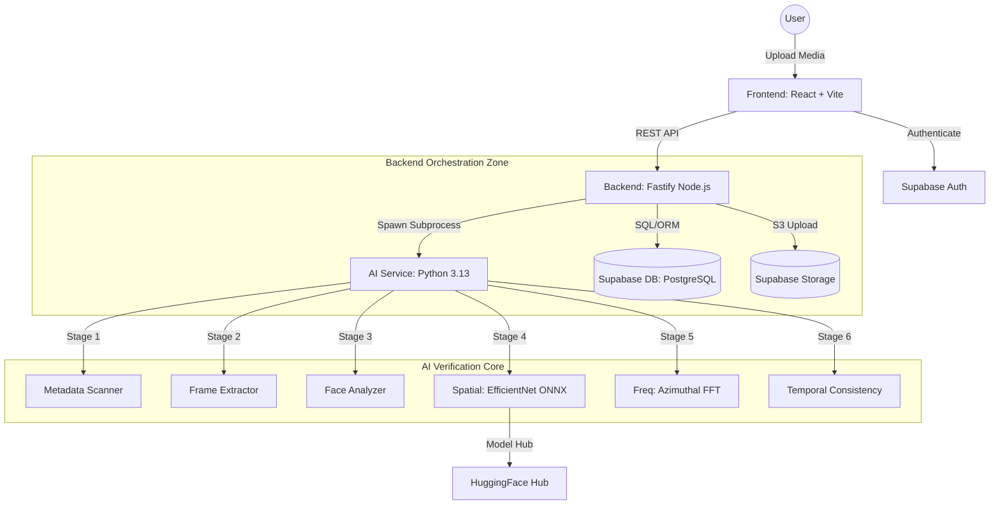

# Trueframe System Architecture

This document provides a technical breakdown of the Trueframe platform, an authenticity-first social media system designed to detect and block deepfakes at the point of ingestion.

## 1. High-Level Block Diagram

---

## 2. Component Specifications

### A. Frontend Layer (React/TypeScript)
*   **Core**: Built with **React 18** and **Vite**.
*   **Styling**: **Tailwind CSS** with **Shadcn UI** (Radix primitives).
*   **State Management**: **React Query** for server state and polling AI verification results.
*   **Key Files**:
    *   `src/pages/Feed.tsx`: Trust-ranked content delivery.
    *   `src/pages/Upload.tsx`: Multi-step verification wizard.
    *   `src/components/ui/TrustShield.tsx`: Real-time authenticity score visualization.

### B. Backend Layer (Fastify Node.js)
*   **Performance**: Uses **Fastify** for low-overhead API routing and multipart handling.
*   **Orchestration**: Manages the "Fail-Closed" verification pipeline.
*   **AI Runner**: Located in `backend/src/lib/ai-runner.ts`, it spawns the Python AI engine as a child process and parses JSON output from `stdout`.
*   **Trust Logic**: `backend/src/lib/trust.ts` calculates the final **Authenticity Score (0-100)** based on weighted AI signals.

### C. AI Verification Core (Python)
*   **Engine**: Python 3.13 utilizing **PyTorch**, **ONNX Runtime**, and **OpenCV**.
*   **Stage 1: Metadata Scanner**: Detects EXIF tampering and file container inconsistencies.
*   **Stage 2: Spatial Analysis**: Uses **EfficientNet-B0** (optimized via ONNX) to detect pixel-level blending and generative artifacts.
*   **Stage 3: Frequency Domain**: Employs **Azimuthal FFT** to identify unnatural power spectral density distributions typical of GANs.
*   **Stage 4: Temporal Consistency**: Analyzes cross-frame patches (Max 32 frames @ 1 FPS) to detect frame-swapping or temporal flickering.

### D. Data & Storage (Supabase)
*   **Database**: **PostgreSQL** with RLS (Row Level Security) policies.
*   **Storage**: S3-compatible buckets for **verified-media** and temporary **raw-uploads**.
*   **Auth**: JWT-based session management integrated directly with the frontend client.

---

## 3. Data Flow (Verification Pipeline)
1.  **Ingestion**: User uploads media via `UploadStep.tsx`.
2.  **Buffering**: Backend buffers the file and generates a temporary `verification_id`.
3.  **Analysis**: `AI Runner` triggers the Python process.
4.  **Verdict**: If `Score > Threshold`, media is moved to permanent storage and published.
5.  **Fail-Closed**: Any timeout (>120s) or AI error results in an automatic **REJECTED** status.

---

## 4. Visual Architecture (Excalidraw)
A professional, editable version of this architecture is available in the project:
`scratch/detailed-architecture.excalidraw`

To edit:
1. Open [excalidraw.com](https://excalidraw.com).
2. Drag and drop the `.excalidraw` file onto the canvas.
