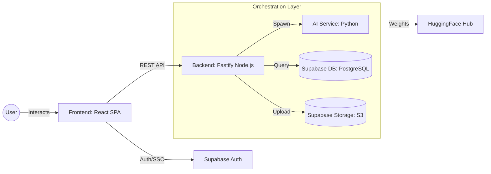
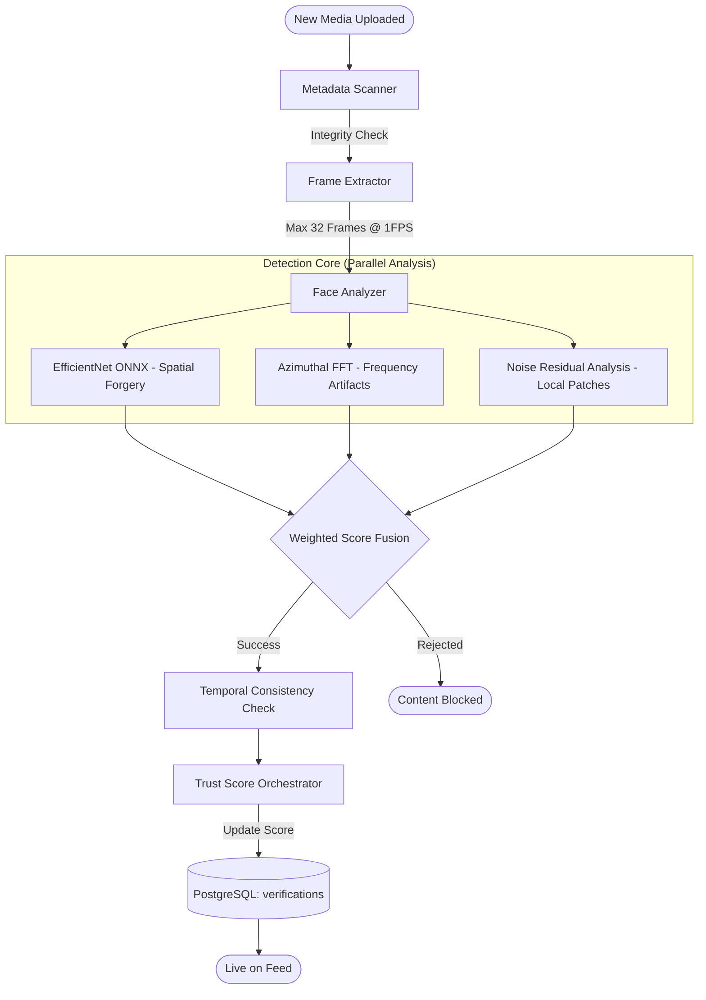
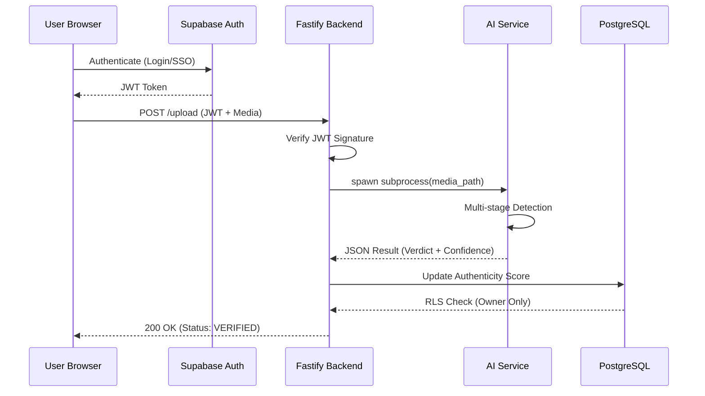

# Trueframe System Architecture

Trueframe is an authenticity-first social media ecosystem designed to eradicate deepfakes and misinformation at the source. This document provides a multi-perspective architectural breakdown of the platform.

---

## 1. High-Level System Overview
This diagram illustrates the primary communication paths between the user, the application layers, and the cloud infrastructure.

### Component Summary:
- **Frontend**: Built with Vite, React, and Tailwind. Handles real-time verification progress and trust-ranked feed rendering.
- **Backend**: An orchestration layer using Fastify. Manages the "fail-closed" verification logic and data integrity.
- **AI Service**: A modular Python engine performing deep feature extraction and forgery detection.
- **Supabase**: Unified backend providing PostgreSQL, S3 Storage, and JWT-based Authentication.

---

## 2. Deep AI Verification Pipeline
This diagram provides a deep-dive into the multi-stage detection process that occurs for every piece of content uploaded to Trueframe.

### Deep Analysis Details:
- **Spatial Forgery**: Uses EfficientNet-B0 to detect pixel-level inconsistencies, blending borders, and unnatural textures.
- **Frequency Artifacts**: Analyzes the Power Spectral Density (PSD) using Azimuthal Integration to find periodic noise patterns typical of GAN-generated content.
- **Temporal Consistency**: (For Video) Ensures that the verification verdict remains stable across multiple frames to prevent "stitching" attacks.
- **Fail-Closed Logic**: If any component (AI model, timeout, or extractor) fails, the content is automatically rejected by default.

---

## 3. Data Flow & Security
This diagram focuses on the movement of sensitive data and the security boundaries.

### Security Highlights:
- **JWT Enforcement**: All API routes are protected by JWT verification against Supabase Auth.
- **Row-Level Security (RLS)**: PostgreSQL tables are locked down so users can only modify their own verification records.
- **Isolated AI Process**: The AI engine runs as a separate subprocess with restricted permissions, preventing potential remote code execution via malicious media files.

---

## 4. Technology Stack
| Layer | Technologies |
|---|---|
| **Frontend** | React 18, Vite, TypeScript, Tailwind CSS, Shadcn UI, TanStack Query |
| **Backend** | Node.js, Fastify, TSX, Zod (Validation), Redis (Caching) |
| **AI / ML** | Python 3.13, PyTorch, ONNX Runtime, OpenCV, MediaPipe |
| **Infrastructure** | Supabase (PostgreSQL, Storage, Auth), Vercel |

---

## 5. Visual Excalidraw Diagram
For a fully interactive visual representation, refer to the generated `.excalidraw` file in the project workspace:
- `detailed-architecture.excalidraw`
